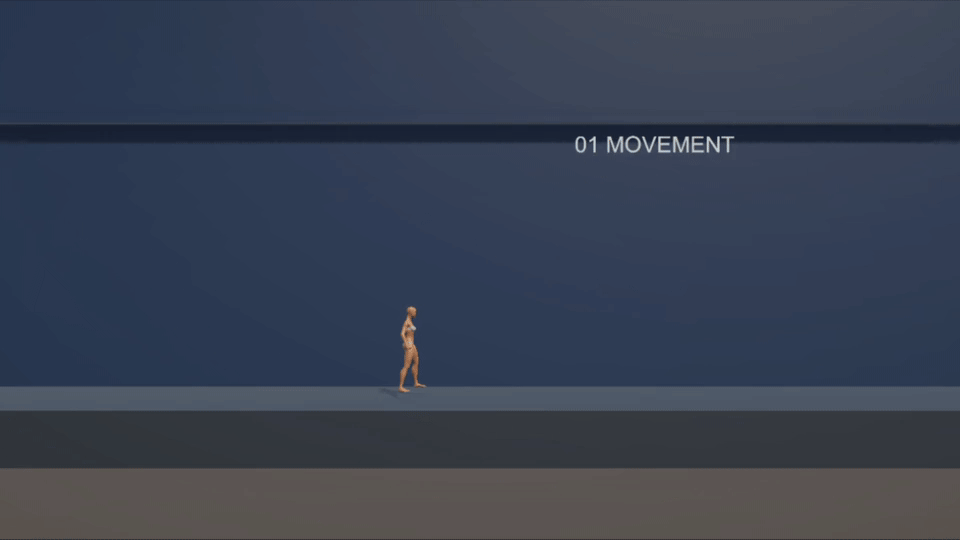
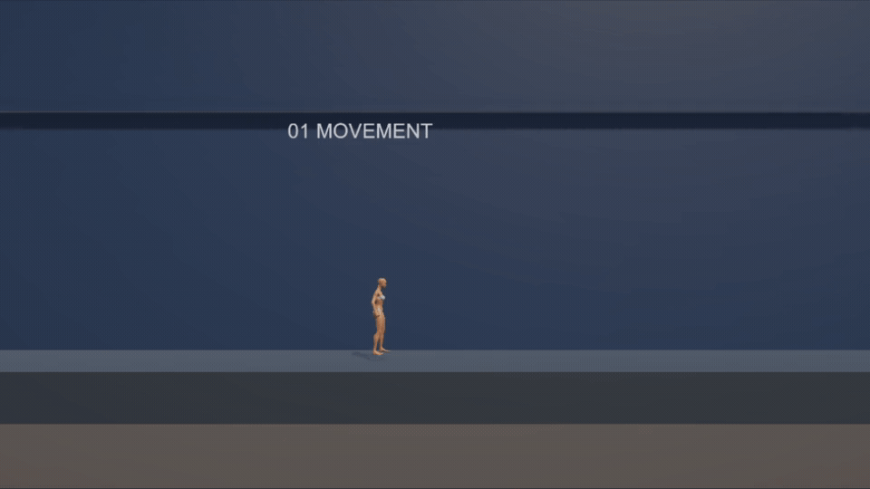
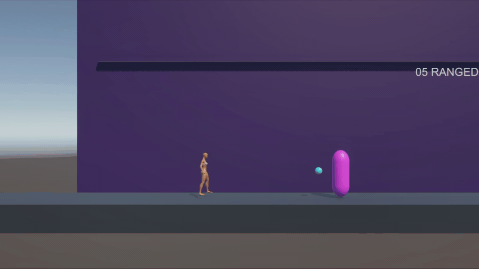
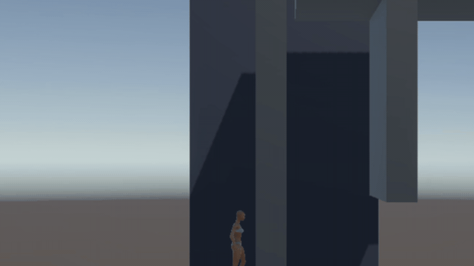

# 01. 이동 시스템

> `SideScrollerMotor`가 Unity 충돌과 상태 시간을 실행하고
> `MovementMath`·`WallTraversalMath`가 결정적인 수식을 계산하도록 분리해,
> 가속 이동부터 곡선 대시·2단 점프·공중 대시·벽 점프까지 하나의 2.5D
> 이동 흐름으로 구현했다.

## 포트폴리오 목표

2.5D 횡스크롤에서 입력, 가속, 점프 능력, 대시, 카메라를 서로 독립적인
책임으로 나누고, 이동 능력이 추가되어도 기존 이동 코드를 크게 수정하지 않는
구조를 검증한다.

## 해결한 문제와 화면 결과

| 해결하려던 문제 | 적용한 코드 규칙 | 플레이에서 보이는 결과 |
|---|---|---|
| 키보드와 스틱 입력 크기가 달라 이동 감각이 달라짐 | `MovementMath.HorizontalInput`에서 Clamp와 Dead Zone을 한 번 적용 | 작은 스틱 흔들림은 무시하고 키보드와 같은 좌우 계약 사용 |
| 발판 끝에서 점프 입력이 너무 엄격함 | `SideScrollerMotor`가 코요테 타이머와 점프 버퍼를 별도로 보유 | 조금 늦거나 조금 빠른 Space 입력도 자연스럽게 점프로 연결 |
| 대시가 급가속·급정지해 브레이크처럼 보임 | 정규화 시간에 사인 완화 곡선을 적용해 대시 수평 속도 계산 | 출발 속도를 잃지 않으면서 중앙이 가장 빠르고 종료가 부드러운 짧은 대시 |
| 공중 대시와 2단 점프 사용 횟수가 꼬임 | 착지와 점프 성공 시 공중 대시·공중 점프 상태를 명시적으로 재설정 | 점프에 의한 공중 대시 리필과 한 번의 2단 점프 |
| 벽 점프가 벽에서 너무 멀리 튕김 | `WallTraversalMath`로 반대 방향 속도를 계산하고 짧은 입력 잠금만 적용 | 좁은 샤프트 안에서 연속 벽 점프 가능 |
| 대시 공격·공중 공격이 이동을 강제로 고정함 | 전투는 체공 시간만 요청하고 수평 속도는 Motor가 계속 소유 | 공격 중 방향 전환과 공중 대시 연계 유지 |

## 핵심 코드와 책임

| 코드 | 책임 | 이 코드로 구현한 움직임 |
|---|---|---|
| `SideScrollerMotor.cs` | 입력 버퍼, 수평·수직 속도, 대시·무적 타이머와 `CharacterController.Move` 실행 | 걷기·달리기·점프·대시·체공·벽 이동의 실제 캐릭터 이동 |
| `MovementMath.cs` | 입력 정규화, 방향, 대시 방향과 점프 초기 속도 계산 | 데드존이 있는 좌우 입력, 마지막 방향 대시, 높이가 일정한 점프 |
| `WallTraversalMath.cs` | 벽 법선, 벽 방향 입력, 낙하 제한과 반발 속도 계산 | 벽 잡기·느린 미끄러짐·반대편 벽 점프 |
| `PlayerAbilityState.cs` | 2단 점프·공중 대시·벽 이동 ID 보유 여부 | 능력을 얻기 전후 같은 Motor가 다른 이동 범위를 제공 |
| `PlayerAnimator.cs` | 확정된 이동 상태를 Animator 매개변수로 변환 | Idle·Walk·Jog·Sprint·Jump·Dash 표현 |

## 코드에서 움직임까지의 흐름

```text
Input System의 A/D·Space·Shift
  → SideScrollerMotor가 입력 버퍼와 상태 타이머 갱신
  → MovementMath / WallTraversalMath가 방향과 속도 계산
  → 능력 ID·접지·벽 접촉·대시 가능 여부 확인
  → CharacterController.Move로 X/Y 이동, Z축 고정
  → 확정 속도와 상태를 PlayerAnimator·Feedback 이벤트에 전달
```

이 구조에서 순수 계산 클래스는 `Time`, `Transform`, Collider를 읽지 않는다.
따라서 점프 공식, 벽 방향과 잘못된 중력 값 같은 경계 조건은 EditMode에서
검사하고, 실제 충돌·입력 연계만 PlayMode에서 확인할 수 있다.


## 현재 구현

- `SideScrollerMotor`: CharacterController 기반 수평·수직 이동
- 코요테 타임과 점프 입력 버퍼
- 더블점프와 점프 시 공중 대시 리필
- 지상·공중 대시와 `0.2초` 이동보다 `0.1초` 긴 총 `0.3초` 무적
- 짧은 벽 잡기, 벽 미끄러짐과 반대 방향 벽 점프
- 벽 점프 반발력 `3.6`, 입력 잠금 `0.04초`로 좁은 수직 통로에서 과도하게
  멀어지지 않도록 조정
- 대시 후 Shift 홀드 달리기 연계
- `MovementMath`: 순수 계산 함수와 EditMode 테스트
- `WallTraversalMath`: 벽 법선·방향 입력·미끄러짐·반발 속도 계산
- CharacterController 경사 제한 45도와 0.3m 계단 오프셋
- Main Graybox의 `Slope_Test` 경사면과 `Step_A/B` 계단

## 구현 방식 비교

| 방식 | 장점 | 단점 | 현재 선택 |
|---|---|---|---|
| Transform 직접 이동 | 단순하고 빠른 프로토타입 | 충돌·경사 처리가 직접 필요 | 초기 Graybox |
| Rigidbody | 물리 상호작용이 자연스러움 | 정밀한 횡스크롤 제어가 어려움 | 비교 대상 |
| CharacterController | 충돌과 직접 제어의 균형 | 물리 기반 반응은 별도 구현 | 현재 사용 |

## 시연 자료



`SideScrollerMotor`가 입력 버퍼와 현재 이동 상태를 갱신하고,
`MovementMath`가 입력 방향과 점프 초기 속도를 계산한다. 영상에서는 가속
이동 뒤 지상 대시와 달리기가 연결되고, 1차 점프가 낙하로 전환된 뒤 2단
점프로 다시 상승한다. 이어서 청록 Trail이 표시되는 공중 대시와 착지까지
하나의 흐름으로 확인할 수 있다.

### 대시 속도 곡선과 달리기 전환



앞부분은 정상 속도, 뒷부분은 같은 입력의 `0.45배속` 재생이다. 달리기 중
Shift를 누르면 청록 Trail과 함께 대시 상태로 전환되고, 대시 종료 뒤에는
Shift 홀드 여부를 읽어 Sprint 상태로 복귀한다. 느린 재생에서는 시작과 끝의
속도를 완전히 0으로 만들지 않고 중앙에서만 최고 속도에 도달하는 변화를
확인할 수 있다.

```text
t = dashElapsed / dashDuration
curveMultiplier = 0.72 + 0.28 × sin(π × t)
horizontalSpeed = dashDirection × dashSpeed × curveMultiplier
```

`0.72`의 기본 속도를 남긴 이유는 곡선의 양 끝을 0으로 만들었을 때 생기던
느린 출발과 급제동 느낌을 피하기 위해서다. `0.2초` 동안 시작·종료는 최고
속도의 72%, 중앙은 100%가 되어 짧은 회피 거리와 즉각적인 입력 반응을 함께
유지한다.

### 대시 이동과 무적 판정 분리



앞 장면에서는 원거리 적의 청록 탄환이 플레이어에게 닿아 빨간 피격 피드백이
발생한다. 다음 장면에서는 같은 방향의 탄환을 Shift 대시로 통과하며 데미지는
거부하지만 탄환은 제거하지 않는다. `SideScrollerMotor`가 대시 이동
`0.2초`와 무적 `0.3초`를 별도 타이머로 소유하기 때문에, 이동이 끝나는 경계의
작은 입력 오차까지 보호하면서 `0.48초` 쿨다운 전체가 무적이 되는 문제는
피했다.

### 벽 이동



벽 방향 입력을 유지하면 `WallTraversalMath`가 최근 벽 접촉의 법선과 입력
방향을 비교해 짧은 잡기와 제한된 미끄러짐을 결정한다. 점프할 때는 반대 방향
수평 속도 `3.6`과 짧은 입력 잠금 `0.04초`만 적용하므로, 좁은 샤프트에서도
벽에서 과도하게 멀어지지 않고 연속 벽 점프 후 정상에 착지할 수 있다.

### 경사와 작은 단차


Main의 15도 경사면 끝에는 회전된 메시와 바닥 사이의 작은 수직 단차가 있다.
플레이어가 별도의 점프 없이 경사면에 올라선 프레임으로, CharacterController의
45도 `Slope Limit`과 `0.3m Step Offset`이 경사·단차 통과에 함께 관여하는
테스트 구성을 보여준다.

## 대시 무적 시간

대시 이동은 `0.2초`, 무적은 `0.3초`로 서로 다른 타이머가 소유한다. 이동
시간으로 무적을 강제로 제한하면 캐릭터끼리 통과하는 순간과 공격 판정 프레임의
작은 차이 때문에 성공한 회피가 피격으로 보일 수 있다. 종료 뒤 `0.1초` 여유는
그 입력 오차를 완화하지만, `0.48초` 쿨다운 전체를 보호하지는 않는다.

## 다음 개선

- 이동 상태와 전투 상태를 명시적인 모듈로 분리
- `CaptureStudio`에서 능력별 잠금 상태 토글 제공
- 이동 플랫폼 검증
- 게임패드 확보 후 스틱 데드존과 버튼 배치의 실제 플레이 조정
- 정면 원근 카메라의 FOV·거리·화면비별 구도 체감 조정
